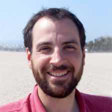
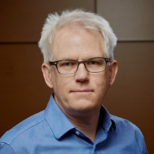
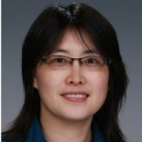
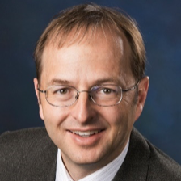
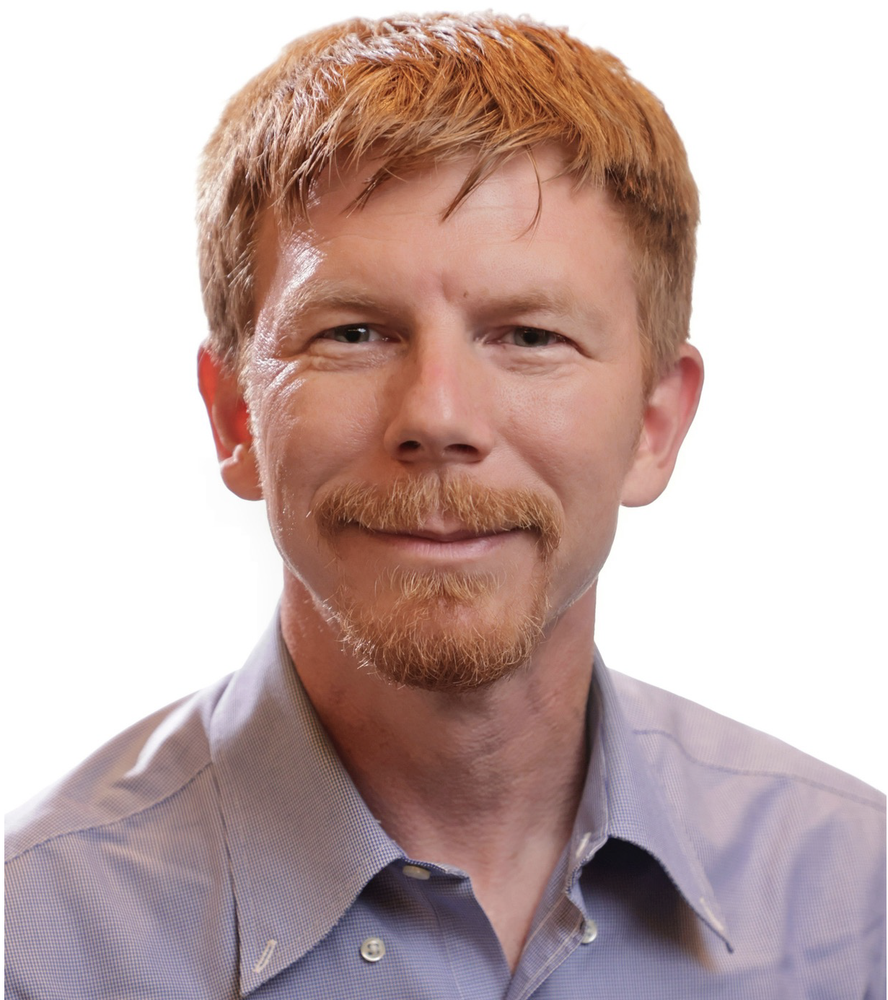
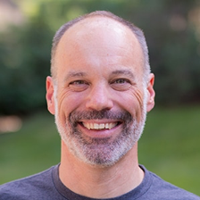
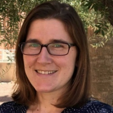
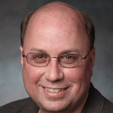

<h1>IDEAS-Watersheds Team Members</h1>

<h3>LBNL Watershed Function SFA (LBNL)</h3>

<table style="width:100%"><tr>

<td style="width:20%;text-align:center;border: none;">
 
<strong>Seri Molins</strong> 
<em>Lead</em>
</td>

<td style="width:20%;text-align:center;border: none;">
 
<strong>Zexuan Xu</strong> 
<a href="https://github.com/zexuanxu" > <i class="fab fa-github" style="font-size:24px"></i></a>
</td>

<td style="width:20%;text-align:center;border: none;">
 
<strong>Erica Siirila-Woodburn</strong> 
<em></em>
</td>

<td style="width:20%;text-align:center;border: none;">
 
<strong>Dipankar Dwivedi</strong> 
<a href="https://github.com/ddwivedi08" > <i class="fab fa-github" style="font-size:24px"></i></a>
</td>

<td style="width:20%;text-align:center;border: none;">
 
<strong>Andrew Graus</strong> 
<em></em>
</td>

</tr></table>

<h3>Watershed Dynamics and Evolution (WaDE) SFA (ORNL)</h3>
<table style="width:100%"><tr>

<td style="width:20%;text-align:center;border: none;">
 
<strong>Scott Painter</strong> 
<em>Lead</em>
</td>

<td style="width:20%;text-align:center;border: none;">
 
<strong>Saubhagya Rathore</strong> 
<a href="https://github.com/saubhagya-gatech" > <i class="fab fa-github" style="font-size:24px"></i></a>
</td>

<td style="width:20%;text-align:center;border: none;">
 
<strong>Jesus Gomez Velez
</strong> 
<em></em>
</td>

<td style="width:20%;text-align:center;border: none;">
 
<strong>Phong Le</strong> 
<em></em>
</td>

<td style="width:20%;text-align:center;"></td>

</tr></table>

<h3>River Corridor SFA (PNNL)</h3>
<table style="width:100%"><tr>

<td style="width:20%;text-align:center;border: none;">
 
<strong>Xingyuan Chen</strong> 
<em>Lead</em>
</td>

<td style="width:20%;text-align:center;border: none;">
 
<strong>Zhi Li</strong> 
<em></em>
</td>

<td style="width:20%;text-align:center;border: none;">
 
<strong>Katie Muller
</strong> 
<em></em>
</td>

<td style="width:20%;text-align:center;border: none;">
 
<strong>Tasneem Ahmadullah</strong> 
<em></em>
</td>

<td style="width:20%;text-align:center;border: none;">
 
<strong>Mingjie Shi</strong> 
<em></em>
</td></tr>

<tr style="border-top: none;">
<td style="width:20%;text-align:center;border: none;">
 
<strong>Hyun-Seob Song</strong> 
<em></em>
</td>

</tr></table>

<h3>Land Model Interface (LMI)</h3>

<table style="width:100%"><tr>

<td style="width:20%;text-align:center;border: none;">
 
<strong>David Moulton</strong> 
<em>Lead</em>
</td>

<td style="width:20%;text-align:center;border: none;">
 
<strong>Adam Atchley</strong> 
<em></em>
</td>

<td style="width:20%;text-align:center;border: none;">
 
<strong>Erica Siirila-Woodburn</strong> 
<em></em>
</td>

<td style="width:20%;text-align:center;border: none;">
 
<strong>Ethan Coon</strong> 
<em></em>
</td>

<td style="width:20%;text-align:center;border: none;">
 
<strong>Rich Fiorella</strong> 
<em></em>
</td>

</tr></table>

<h3>Integrated Hydrologic Simulation Infrastructure (IHSI)</h3>

<table style="width:100%"><tr>

<td style="width:20%;text-align:center;border: none;">
 
<strong>Reed Maxwell</strong> 
<em>Lead</em>
</td>

<td style="width:20%;text-align:center;border: none;">
 
<strong>Laura Condon</strong> 
<em>Lead</em>
</td>

<td style="width:20%;text-align:center;border: none;">
 
<strong>George Artavanis</strong> 
<em></em>
</td>

<td style="width:20%;text-align:center;border: none;"></td>
<td style="width:20%;text-align:center;border: none;"></td>

</tr></table>

<h3>Software Ecosystem</h3>

<table style="width:100%"><tr>

<td style="width:20%;text-align:center;border: none;">
 
<strong>David Moulton</strong> 
<em>Lead</em>
</td>

<td style="width:20%;text-align:center;border: none;">
 
<strong>Rich Fiorella</strong> 
<em></em>
</td>

<td style="width:20%;text-align:center;border: none;"></td>
<td style="width:20%;text-align:center;border: none;"></td>
<td style="width:20%;text-align:center;border: none;"></td>

</tr></table>

<h3>Software Stewards</h3>

<table style="width:100%"><tr>

<td style="width:20%;text-align:center;border: none;">
 
<strong>Steve Smith</strong> 
<em>Lead</em>
</td>

<td style="width:20%;text-align:center;border: none;">
 
<strong>Ethan Coon</strong> 
<em></em>
</td>

<td style="width:20%;text-align:center;border: none;">
 
<strong>Glenn Hammond</strong> 
<em></em>
</td>

<td style="width:20%;text-align:center;border: none;">
 
<strong>Sergi Molins</strong> 
<em></em>
</td>

<td style="width:20%;text-align:center;border: none;"></td>
</tr></table>

<h3>Team Alumni</h3>
Dave Gochis (NCAR), Kewei Chen (PNNL), Joe Beisman (LANL), Ilhan Ozgen (LBNL), Ahmad Jan (ORNL), Peishi Jiang (PNNL), Pin Shuai   (PNNL), Xuehang Song (PNNL), Hoang Tran  (Colorado School of Mines), Mary Michael (Colorado School of Mines), Jun Zhang  (University of Arizona), Jen Stayeart (University of Arizona), Daniel Livingston (LANL), Angelic Arzola Roig (LANL) 

