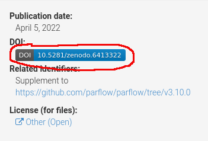
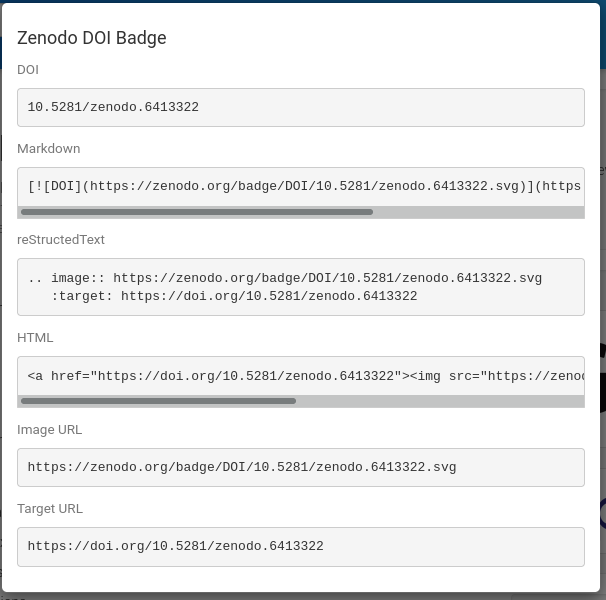

<h2>IDEAS-Watersheds Archiving and DOI Best Practices (DRAFT)</h2>

The IDEAS-Watersheds Software Ecosystem DOI best practices are intended to enhance provide help setting up and maintaining Digital Object Identifier (DOI) for primary software projects.   DOI's are increasingly necessary for papers publishing results of simulations and help improve repeatability by have a unique identifier for a software release.   An archive of the software is also obtainable given a DOI from sites such as Zenodo and DOE CODE.   Once a DOI for the file archive is created the file archive is fixed so one is guaranteed to be able to obtain the exact same software release.   We discuss archiving and DOI generation in the same context because they are linked topics, how you create long-lived archives and how to create a long lived references/name are related topics.

One of our software polices is for primary codes to have a DOI for releases.   This guide is intended to help projects setup an automated method for generating DOI's in order to minimize the cost of maintaining DOI's.   This guide also provides some help publishing code releases on the DOE CODE site for visibility and archival purposes.

First, we will focus on the Zenodo system since it supports fully integration with GitHub, manual updates for projects not on GitHub, and is widely supported and used in the open science community.   Second we discuss using the DOE CODE site which also supports DOI generation and archiving.

Zenodo is a free and open-access repository operated by the European Organization for Nuclear Research (CERN).   Zenodo is a repository of data sets, research software, reports, and any other research related digital artifacts.   In addition to the repository features it offers persistent DOI generation to allow easy citation and finding of data objects.   For purposes of this best practice guide, we will focus on the DOI generation and arching of software.

DOE CODE is a DOE maintained software service for DOE funded code projects.   It provides archiving, searching and discover of scientific and business software.   DOE CODE is run by the Office of Scientific and Technical Information (OSTI).   DOE CODE can generate DOI numbers but does not have the GitHub integration support of Zenodo so for GitHub projects we recommend Zenodo for generating DOI's.   We recommend creating entries at DOE CODE for the primary software projects even if you are using Zenodo.  For project not using GitHub DOE CODE provides both archiving and DOI generation for file uploads.

<h3>Zenodo</h3>

<h4>Setting up Zenodo</h4>

Since Zenodo is widely used there are a large number of tutorial videos and websites with tutorials documenting how to use Zenodo.   This video provides a nice overview of Zenodo and how to manually upload files and generate a DOI for them [How to upload data to Zenodo for open science?](https://www.youtube.com/watch?v=S1qK_TA52e4)

Zenodo maintains a help page with additional useful information here [Zenodo Help](https://help.zenodo.org/)

<h4>Integration of Zenodo and GitHub</h4>

Automation can make the process of DOI generation and archives easy and saves extra manual steps in your release process.   The integration of Zenodo and GitHub is extremely simple.   You can log into Zenodo using your GitHub credentials, select repositories to enable DOI generation and DOI's will be generated automatically for every GitHub software release.  The entire setup for a project will likely take no more than an hour or two.   Most of that time will be editing the metadata for the project, setting up the Zenodo/GitHub integration is trivial.

Again there are many videos and guides available online.   This video demonstrates how easy the GitHub intregration setup is [How to make open-source code citable with GitHub and Zenodo?](https://www.youtube.com/watch?v=gp3D4mf6MHQ)

Here is an tutorial article with the same information if you prefer text [Connecting GitHub with Zenodo](https://emilio-berti.github.io/idiv-git-introduction/21-github_zenodo/index.html).

<h4>Zenodo Setup Suggestions</h4>

One issue with a DOI for software is a DOI is normally a reference to a single specific document/file.   This feature is important for repeatability, you need the exact version used.   However software is constantly changing so there is value in having a DOI for software project that isn't tied to a specific version when you need a general reference to the project.   Zenodo supports this with a DOI that is created for the software project and a DOI that is for each release.   The general DOI will take you to the latest version and previous versions are shown in a side panel.

A feature of Zenodo is providing a DOI badge that can be included in your readme files, web pages etc.  Users clicking on the badge will be directed to the Zenodo page for the project.  To get a link to the badge for inclusion in other documents, click on the badge on the Zenodo page for your code:

 

A popup should come up with a list of link options for markdown, HTML, etc.  For example copying the supplied text to a README.md file in your GitHub project will render the DOI badge when users are viewing the README.

 

You can get a badge for the general DOI or for a specific release.

<h3>DOE CODE</h3>

<h4>Setting up DOE CODE</h4>

An high level overview of DOE CODE is avaialable in this video [Introducing DOE CODE](https://www.youtube.com/watch?v=NKo0U92PXzA)

A set of tutorial slicdes on setting up a project is avialable on the IDEAS-Watersheds software page at [DOE CODE Slides](https://docs.google.com/presentation/d/1DgVAqFkQiuD-03XJy5GqDxNsYr7Robdl/edit?usp=sharing&ouid=111484267752678144523&rtpof=true&sd=true).

A video of this presentation is here [DOE CODE Presentation](https://drive.google.com/drive/folders/1VOLL0PctOdw44e7mDi11rmAiKRJq1Pc_?usp=sharing).

OSTI provides a [DOE CODE FAQ](https://www.osti.gov/doecode/faq) which has useful suggestions and help setting up projects.

If your are using a public repository DOE CODE will auto populate many of the meta-data fields from the repository.

The longest step for initial setup was editing the contributors section.  DOE-CODE imports the usernames from GitHub but that didn't seem super useful.   On the ParFlow project some manual editing of the auto-imported to fill out full names and institions when known was done.

<h4>Updating DOE CODE</h4>

TODO add some figures here?

For the ParFlow project the following steps are used updating DOE CODE.  ParFlow is using Zenodo to automatically generate the DOI so updating is simply making a new version on DOE CODE using the Zenodo generated DOI.   If you do not have a DOI, DOE CODE can generate one for you.

- Go got DOE CODE.

- Go to the "Manage My Projects" page.

- Select the Make Version / New button on the project to release.

- In Product Description update the version number

- In DOI and Release Date section fill in DOI from Zenodo and release date.  If you are manually updating you can reserve a DOI and have DOE CODE provide you with a new DOI for the release.

- Edit other fields if you have updates.

- Submit Project when done.

<h4>DOE CODE Setup Suggestions</h4>

Open Questions:

SGS - Thought it was possible to upload a tarball of software to DOE code.  Initial browsing of Submit New Software Project forms, didn't see how this was done.

<h3>General Guidelines</h3>

The Intergovernmental Science-Policy Platform on Biodiversity and Ecosystem Services (IPBES) is using Zenodo as part of their data management practices and has a nice write-up on using Zenodo [Zenodo Guidelines](https://ict.ipbes.net/data-management/technical-guidelines/Zenodo)

<h3>Advanced Topics</h3>

TODO Discuss the metadata files that Zenodo and DOE-CODE can use if a file is provided in the repository.   Can help with populating meta-data.
